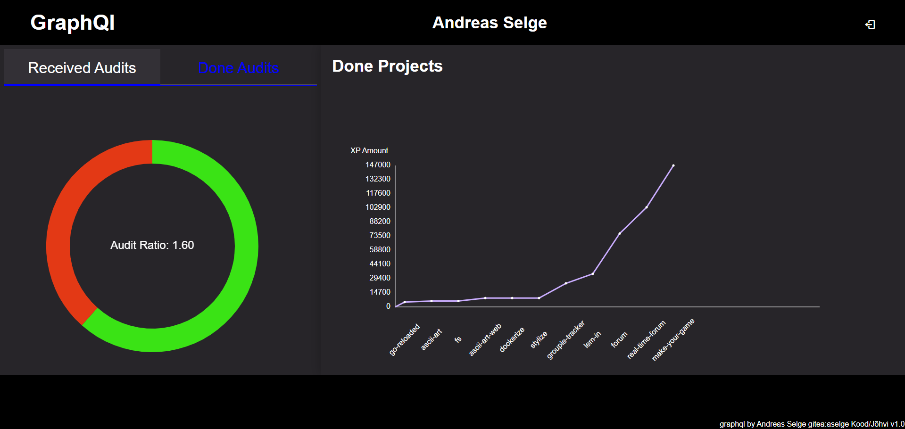

# graphql


Version 1.1

GraphQL is a query language for APIs and a runtime for fulfilling those queries with your existing data.

## Table of Contents

- [Getting Started](#getting-started)
	- [Prerequisites](#prerequisites)
- [Installation](#installation)
	- [Hosting](#hosting)
	- [Using Terminal](#using-terminal)
- [Author](#author)

## Getting Started

### Prerequisites

Git and NodeJs should be installed on your machine. Also have your <a href="https://github.com/01-edu/public/blob/e8b56a127d4d67e203196fb4134e2676554d304c/subjects/graphql/audit/README.md">Audit Page</a> ready.

### Installation

#### Hosting

This application is being hosted in: https://someretiskin.github.io/graphql-andreas

#### Using Terminal

1. Clone the repository:
   ```bash
   git clone https://01.kood.tech/git/aselge/graphql.git
   cd graphql-andreas-main
   ```
2. Install/Update dependencies and run the program:
   ```bash
   npm install
   npm run start
   ```
3. Open your browser and navigate to http://localhost:4000.

## Author

### Andreas Selge

<p>aselge</p>
* <b>Gitea:</b> https://01.kood.tech/git/aselge
